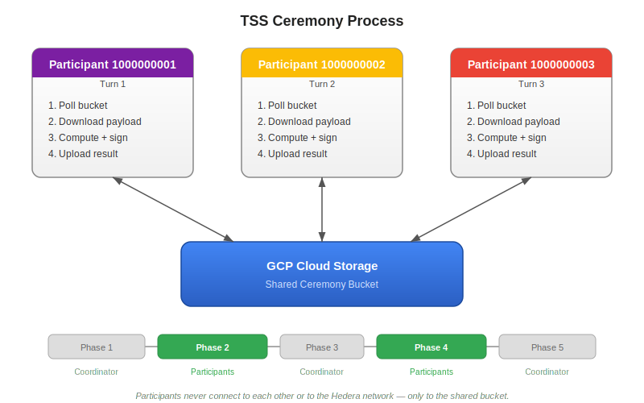

# Hedera TSS Ceremony Helper

This repository contains a helper tool for the Hedera TSS Ceremony. It provides
a containerised environment to run the ceremony software, including key management
and logging. The container downloads the ceremony JAR at startup from a configurable
URL.

> **Ceremony window: April 8 – May 12, 2026.** Your machine must stay online for the entire window.
> See [Background](docs/background.md) for details on the turn-based protocol and responsibilities.

## How the ceremony works

The ceremony runs **disconnected from the Hedera network**. The only
connection required is between participants' machines and a shared Google Cloud Storage
bucket used to exchange data with other participants and the coordinator.

In detail:

1. Each participant is assigned a turn. Your machine **polls the GCP bucket** waiting for its turn.
2. When it is your turn, the program **downloads the output produced by the previous participants**.
3. It **applies its computation** on that payload, **signs the result**, and **uploads it** back to the bucket.
4. The next participant picks it up and repeats the process.

The ceremony has 5 phases. Participants operate on **phase 2 and phase 4** only;
the remaining phases are handled by the ceremony coordinator.



For more details about what the TSS ceremony is, how it works, and what this repository does, see
[Background](docs/background.md).

## Hardware requirements

- CPU: 2 cores (4 threads)
- RAM: 16 GB
- Storage: 60 GB SSD
- Network: 1 Gbps

## What you need to join the ceremony

- **Participant ID** — A unique integer identifier for your machine, **assigned and provided to you by the Hedera team**.
- **Participant private key and public certificate** — Placed in `./keys/`. You can generate them with the
  [provided script](#generating-keys-and-certificates) or create your own.
- **GCP S3 credentials** — HMAC access key and secret key for accessing the ceremony bucket.
  See [Step 2](#create-gcp-s3-credentials) below.
- **Online access** — Your machine must be able to reach the Internet for the entire ceremony window.
  All machines communicate through a shared GCP Cloud Storage bucket — there is no offline mode.

## Setup

### Prerequisites

- [Podman](https://podman.io/) — used to build and run the container image.
  Supported on Linux and macOS. On macOS, Podman runs inside a Linux VM
  (`podman machine`), which is initialised automatically by `install-requirements.sh`.
  If not installed, run:

  ```sh
  ./scripts/install-requirements.sh
  ```

#### Create GCP S3 credentials

The ceremony uses GCP Cloud Storage as the communication channel between all participating machines.
Access is authenticated using **HMAC keys**, which are GCP's S3-compatible access credentials.

1. **Create a GCP project** (if you don't have one):
   - Go to the [Google Cloud Console](https://console.cloud.google.com)
   - Click the project dropdown at the top of the page and select **New Project**
   - Enter a project name (e.g. `hedera-tss-ceremony`) and click **Create**
   - Make sure the new project is selected in the project dropdown

2. **Create HMAC keys**:
   - Navigate to **Cloud Storage** > **Settings** (in the left sidebar)
   - Click the **Interoperability** tab
   - If prompted, click **Set default project for interoperability access**
   - Under **Access keys for your user account**, click **Create a key**
   - You will see two values:
     - **Access key** — this is your `TSS_CEREMONY_S3_ACCESS_KEY`
     - **Secret** — this is your `TSS_CEREMONY_S3_SECRET_KEY`

   > **Important:** The secret is shown **only once** at creation time. Copy and save both values
   > immediately in a secure location (e.g. a password manager).

3. **Share your GCP email with the Hedera team** so they can grant your account read and write
   access to the ceremony bucket. Your HMAC keys will not work until they do this.

#### Environment variables

Export the GCP credentials, your participant ID, and some additional variables in your shell before running the scripts:

```sh
export TSS_CEREMONY_S3_ACCESS_KEY="<your-GCP-S3-access-key>"
export TSS_CEREMONY_S3_SECRET_KEY="<your-GCP-S3-secret-key>"
export PARTICIPANT_ID="<your-participant-id>"
```

### Build the container image

Build the default container image (JRE 25) with the following command:

```sh
./scripts/build-oci-image.sh
```

This produces a multi-platform (`linux/amd64` + `linux/arm64`) manifest list in
the local Podman image store tagged `hedera-tss-ceremony-helper:latest`.

### Private key and certificate

Copy or generate your participant key and certificate into the `keys/` directory at the root of this
repository. The directory is mounted into the container as read-only at
`/app/keys/`.

The key and the certificate MUST use a `PARTICIPANT_ID+1` index for the name of the files. For example, if your `PARTICIPANT_ID` is `1000000001`, you should create two files named `s-private-node1000000002.pem` and `s-public-node1000000002.pem`.

Example of the final structure of the `keys/` directory if your `PARTICIPANT_ID` is `1000000001`:

```text
keys/
  s-private-node1000000002.pem    # private key for participant ID 1000000001
  s-public-node1000000002.pem     # corresponding certificate for participant ID 1000000001
```

#### Generating keys and certificates

You can generate a private key and a 60-day self-signed certificate using the provided script:

```sh
./scripts/key-and-certificate-generator.sh ./keys
```

## Deploy and run the ceremony

| Platform | Guide |
| --- | --- |
| Bare metal / VM (Linux or macOS) | [docs/baremetal.md](docs/baremetal.md) |
| GCP Compute Engine | [docs/gcp.md](docs/gcp.md) |
| AWS EC2 | [docs/aws.md](docs/aws.md) |

> **Note:** You can find more details about the costs of the cloud options in a dedicated [cost comparison document](docs/cost-comparison.md).

## Browser based access to the ceremony bucket

You can access the ceremony bucket in the Google Cloud Console at the following URL: <https://console.cloud.google.com/storage/browser/tss-ceremony-testnet>

## Cleanup

Although the private entropy being automatically destroyed by the ceremony code, **remember to clean up the keys and all the associated resources after the ceremony is over**. See each platform's guide for details.

## Additional resources

- [Background](docs/background.md) — What is TSS, how the ceremony works
- [Details about the container image](docs/container-image.md) — Container customization and parameters
- [Troubleshooting](docs/troubleshooting.md) — Common errors and how to fix them
